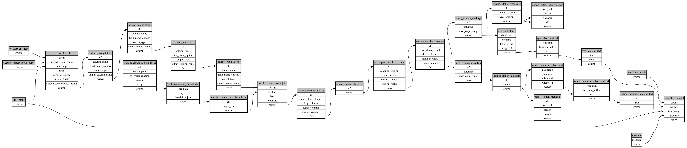

```
# AUTOGENERATED BY ECOSCOPE-WORKFLOWS; see fingerprint in README.md for details

```

```yaml
# fingerprint:
artifacts_sha256_basic: b55677c35b3609719044393493a9525624c39928234810267e2a4549be20b9b0
artifacts_sha256_strict: 78c95f9166b94df4214d58e017a5861483514493eae51fb439ca48041cf1c22d
installed_requirements:
- channel: https://repo.prefix.dev/ecoscope-workflows/
  name: ecoscope-platform
  version: {version: ==2.15.1}
- channel: https://repo.prefix.dev/ecoscope-workflows-custom/
  name: ecoscope-workflows-ext-custom
  version: {version: ==0.1.0rc14}
- channel: https://repo.prefix.dev/ecoscope-workflows-custom/
  name: ecoscope-workflows-ext-ste
  version: {version: ==0.0.0rc1}
- channel: https://repo.prefix.dev/ecoscope-workflows-custom/
  name: ecoscope-workflows-ext-distance-sample-counts
  version: {version: ==1.0.2}
- channel: conda-forge
  name: pydeck
  version: {version: ==0.9.2}
- channel: conda-forge
  name: opentelemetry-sdk
  version: {version: ==1.44.0}
params_sha256: 657673c358696f94a81a79e9f9c1360892d193345f9affec35a903f1363b78bd
spec_sha256: f0c7de09cbbdbe6b9c9cf82821d148ee74778986c835c55f9d3f439c4cd070ff

```

# ecoscope-workflows-dsc-weather-workflow


